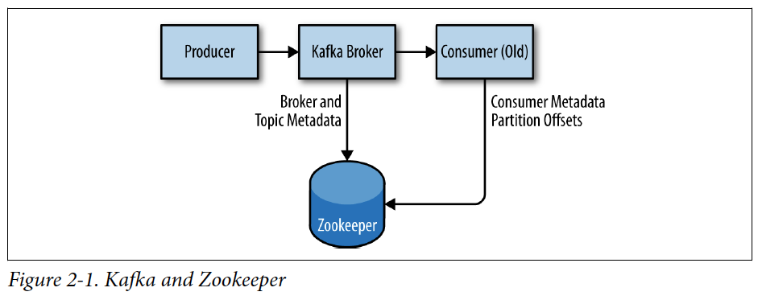
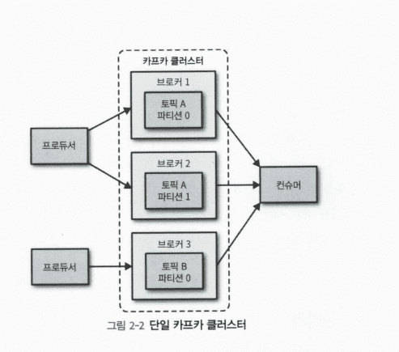

# Chapter 02 "카프카 설치와 구성하기"

## 1. 제일 먼저 할 일

* 운영체제 선택 - 맥 OS
    * 자바 어플리케이션이므로, JRE가 설치될 수 있는 시스템이면 어디서든지 실행 가능하다.
    * 그러나, 리눅스 기반의 운영체제에서 제일 좋은 성능으로 수행되도록 최적화되어 있다.
    * homebrew 를 사용하여 카프카 설치
        * /opt/homebrew/bin: 바이너리와 스크립트 파일
        * /opt/homebrew/etc/kafka: 카프카 구성 파일
        * /opt/homebrew/etc/zookeeper: 주키퍼 구성
        * /opt/homebrew/var/lib/kafka-logs: 카프카 데이터가 위치하는 log.dirs 설정
* 자바 설치
* 주키퍼 설치
    * 
    * 컨슈머 클라이언와 카프카 클라스터에 관한 메타데이터를 저장(예: 환경 설정 정보)
    * 주키퍼 앙상블(=클러스터)
        * 하나의 앙상블은 여러 개의 서버(노드)를 멤버로 갖는다.
        * 하나의 서버에만 서시브가 집중되지 않게 분산하여 동시에 처리하며, 한 서버에서 처리한 결과를 다른 서버와 동기화하여 데이터의 안전성을 보장한다.
        * 서비스가 중단되지 않도록, 서버 문제발생시 다른 서버가 서비스를 이어받아 처리하도록 한다.
        * 앙상블은 홀수개의 서버를 갖는다. 
            * 앙상블의 서버 중 과반수가 작동 가능하면 언제든 요청 처리가 가능하기 때문이다.
            * 서버가 너무 많으면 오히려 성능이 저하될 수 있기 때문에, 다섯 개의 서버 노드가 이상적이다.
    * 주키퍼 서버를 앙상블로 구성하려면 각 서버가 공통된 구성 파일(앙상블의 모든 서버 내역이 포함)을 가져야 한다.
        * 설정 파일: `/opt/homebrew/etc/zookeeper/zoo.cfg`
        * 앙상블의 서버 내역은 {server.X=hostname:peerPort:peerPort:leaderPort} 형식으로 지정
            * X - 각 서버의 ID 번호
            * peerPort - 앙상블의 서버들이 상호 통신하는 데 사용
            * leaderPort - 리더를 선출하는 데 사용
        * 주키퍼에 접속하는 클라이언트는 clientPort에 지정된 포트 번호로 앙상블과 연결하고, 앙상블의 서버들은 peer/leader/clientPort 모두 사용해서 상호 통신한다.

```python
# The number of milliseconds of each tick
tickTime=2000
# The number of ticks that the initial 
# synchronization phase can take
# 팔로어가 리더에 접속할 수 있는 시간, tickTime 기준
# 10 * 200ms = 40초
initLimit=10
# The number of ticks that can pass between 
# sending a request and getting an acknowledgement
# 리더가 될 수 있는 팔로어의 최대 개수
syncLimit=5
# the directory where the snapshot is stored.
# do not use /tmp for storage, /tmp here is just 
# example sakes.
dataDir=/opt/homebrew/var/run/zookeeper/data
# the port at which the clients will connect
clientPort=2181

# 앙상블의 서버 내역 지정
# server.X=hostname:peerPort:peerPort:leaderPort 형식
server.1=zoo1.example.com:2800:3800
server.2=zoo3.example.com:2800:3800
server.3=zoo2.example.com:2800:3800
```

## 2. 카프카 브로커 설치하기

* https://kafka.apache.org/downloads.html
* 설정 파일: `/opt/homebrew/etc/kafka/server.properties`

### $. 주키퍼와 카프카 로컬에 설치하기 - homebrew

* homebrew 사용하여 카프카 설치
    * kafka를 설치하게 되면 기본적으로 zookeeper가 같이 설치 된다.
```
$ brew install zookeeper
$ brew install kafka
```

* kafka, zookeeper 설치 확인
```
$ brew list --formulae --version -v
```

* zookeeper/kafka 실행
```
$ brew services start zookeeper 
$ brew services start kafka
```

* brew 실행 리스트
```
$ brew services list
```

* zookeeper/kafka 설정 파일
```
$ zookeeper-server-start /opt/homebrew/etc/kafka/zookeeper.properties & kafka-server-start /opt/homebrew/etc/kafka/server.properties
```

### $. 설치 및 실행시 발생했던 ERROR

* uninstall & install 
```
[2022-04-07 17:57:51,057] WARN Session 0x0 for sever localhost/[0:0:0:0:0:0:0:1]:2181, Closing socket connection. Attempting reconnect except it is a SessionExpiredException. (org.apache.zookeeper.ClientCnxn)
java.net.ConnectException: Connection refused
	at java.base/sun.nio.ch.Net.pollConnect(Native Method)
	at java.base/sun.nio.ch.Net.pollConnectNow(Net.java:672)
	at java.base/sun.nio.ch.SocketChannelImpl.finishConnect(SocketChannelImpl.java:946)
	at org.apache.zookeeper.ClientCnxnSocketNIO.doTransport(ClientCnxnSocketNIO.java:344)
	at org.apache.zookeeper.ClientCnxn$SendThread.run(ClientCnxn.java:1290)
```

* 카프카 설정파일(카프카 설치 디렉토리/config/server.properties)의 log.dirs 항목에서 설정되어 있는 카프카 로그 path로 가보면 meta.properties라는 파일이 있는데 해당 파일을 지워주고 카프카를 재시작해주면 해결된다.

```
ERROR Fatal error during KafkaServer startup. Prepare to shutdown (kafka.server.KafkaServer)
kafka.common.InconsistentClusterIdException: The Cluster ID 4T6zDgLITRakbga-AdPbDQ doesn't match stored clusterId Some(uBRG9a-xRASQ5mcxpm4SHw) in meta.properties. The broker is trying to join the wrong cluster. Configured zookeeper.connect may be wrong.
	at kafka.server.KafkaServer.startup(KafkaServer.scala:228)
	at kafka.Kafka$.main(Kafka.scala:109)
	at kafka.Kafka.main(Kafka.scala)
```

## 3. 브로커 구성

### $. 핵심 구성 옵션

* broker.id
    * 정수로 된 임의의 번호(식별자)
    * 하나의 카프카 클러스터 내에서는 고유한 값이어야 한다.
    * 유지보수에 부담되지 않도록 브로커 호스트가 갖는 본질적인 값으로 설정하는 것이 좋다.
        * 예: host1.example.com/host2.example.com과 같이 호스트 이름에 고유번호(1과 2)가 포함되어 있다면<br>
        이것을 broker.id 값으로 사용하면 좋다.
* port
    * 카프카의 실행에 사용되는 TCP 포트 
    * 기본 구성값 9092. 1024 이하로 설정한다면 root 권한으로 시작되어야 하므로 바람직하지 않다.
* zookeeper.connect
    * 브로커의 메타데이터를 저장하기 위해 사용되는 주키퍼의 위치
    * 호스트이름:포트/경로 (기본구성 localhost:2181)
        * 카프카 클러스터에는 chroot 경로를 사용하는 것이 좋음<br>- 다른 카프카 클러스터와 애플리케이션이 상호 충돌 없이 주키퍼 앙상블을 공유할 수 있기 때문
        * 다수의 주키퍼 서버(같은 앙상블에 속하는)를 지정하는 것이 좋음<br>- 특정 서버에 장애가 생길 때 같은 주키퍼 앙상블의 다른 서버에 카프카 브로커가 연결될 수 있기 때문
* log.dirs
    * 모든 메시지를 로그 segment 파일에 모아서 디스크에 저장한다.
    * 두 개 이상의 경로가 지정되면 해당 브로커가 모든 경로에 파티션을 저장한다.
    * 브로커가 새로운 파티션을 저장할 때는 가장 적은 디스크 용챵을 사용하는 경로가 아닌, 가장 적은 수의 파티션을 저장한 경로를 사용한다. (즉, 여러 디렉터리에 걸쳐 데이터가 항상 고르게 분산되는 것은 아니다.)
* num.recovery.threads.per.data.dir
    * 카프카는 thread pool을 사용하여 로그 세그먼트를 처리하고, thread pool은 다음 경우에 사용된다.
        * 브로커가 정상적으로 시작될 때는 각 파티션의 로그 세그먼트 파일을 열기 위해 사용된다.
        * 장애 발생 이후 다시 시작될 때는 각 파티션의 로그 세그먼트를 검사하고 불필요한 부분을 삭제하기 위해 사용된다.
        * 종료될 때는 로그 세그먼트 파일을 정상적으로 닫기 위해 사용된다.
    * 기본적으로는 로그 디렉터리당 하나의 스레드만 사용된다.
    * 브로커의 시작과 종료 시에만 사용되므로 병행 처리를 하도록 많은 수의 스레드를 설정하는 것이 좋다.
    * 니 매개변수에 설정하는 스레드의 수는 log.dirs에 지정된 로그 디렉토리마다 적용된다.
* auto.create.topics.enable
    * 기본값 true
    * 아래의 경우에, 브로커는 자동으로 하나의 토픽을 생성한다.
        * 프로듀서가 토픽에 메시지를 쓸 때
        * 컨슈머가 토픽의 메시지를 읽기 시작할 때
        * 클라이언트에서 토픽의 메타데이터를 요청할 때

### $. 토픽의 기본 설정

* num.partitions
    * 새로운 토픽이 몇 개의 파티션으로 생성되는지 지정
    * 카프카 클러스터 내에서 토픽의 크기가 확장되는 방법이 파티션이므로, 브로커가 추가될 때 클러스터 전체에 걸쳐 메시지가 고르게 저장되도록 파티션 개수를 설정하는 것이 중요하다.
* log.retention.ms
    * 카프카가 얼마 동안 메시지를 보존할지 설정
* log.retentions.bytes
    * 저장된 메시지들의 전체 크기(바이트)를 기준으로 만기 처리
    * 모든 파티션에 적용된다.
* log.segment.bytes
    * 로그 세그먼트 파일의 크기
    * 세그먼트가 닫혀야먄 log.retention.ms가 동작한다.
* log.segment.ms
    * 로그 세그먼트가 닫히는 주기
* message.max.bytes
    * 카프카 브로커가 쓰려는 메시지의 최대 크기

## 4. 하드웨어 선택

* 디스크 처리량
    * 프로듀서의 클라이언트 성능에는 로그 세그먼트의 저장에 사용되는 브로커 디스크의 처리량이 가장 큰 영향을 준다.
        * 카프카 메시지를 생성될 때, 서버의 로컬 스토리지에 커밋되며(스토리지에 씀), 메시지가 커밋되었다는 것을 브로커가 확인해줄 때까지 프로듀서 클라이언트는 기다리게 된다. <br>
        그리고 확인되면 메시지 전송이 성공적으로 끝나게 되므로, 디스크에 빨리 쓸수록 프로듀서의 대기 시간은 짧아진다.
    * HDD vs. SDD
* 디스크 용량
    * 일정 기간에 얼마나 많음 메시지가 보존되어야 하는가에 따라 결정
* 메모리
    * 카프카 컨슈머가 읽는 파티션의 메시지는 시스템 메모리의 페이지 캐시(page cache)에 최적화되어 있으므로, 페이지 캐시로 사용되는 메모리가 더 많을수록 컨슈머 클라이언트의 성능이 좋아진다.
    * 카프카 자체는 JVM에서 실행되므로 heap 메모리를 많이 필요로 하지 않는다.
    * 그리고 시스템의 나머지 메모리는 현재 사용 중인 로그 세그먼트들을 저장하는 페이지 캐시로 사용된다.
* 네트워크
    * 카프카가 처리할수 있는 통신 트래픽량을 고려해야 한다.
    * inbound/outboud 네트워크의 균형을 고려해야 한다.
* CPU
    * 브로커 성능에 다소 영향을 줄 수 있지만, 하드웨어 선택의 주된 요소는 아니다.

## 5. 클라우드에서 카프카 사용하기

* AWS의 m4/r3/i2/d2 인스턴스

## 6. 카프카 클러스터



* 다수의 브로커 서버를 하나의 클러스터로 구성할 때의 장점
    * 다수의 서버로 처리량을 분산시켜 확장할 수 있다.
    * 서버 장애에 따른 데이터 유실을 막기 위해 복제(replication)를 할 수 있다.<br>
    → 이를 통해 현재 사용 중인 카프카 시스템을 중단시키지 않고 유지보수 작업을 수행할 수 있다.

### $. 브로커 개수

* 메시지를 보존하는데 필요한 디스크용량과 하나의 브로커에 사용가능한 스토리지 크기를 고려해야 한다.
    * 예: 10TB데이터를 보존해야 하고, 하나의 브로커가 2TB까지 사용가능하자면 최소 5개의 브로커가 필요하다.
* 요청을 처리하기 위한 클러스터의 용량을 고려해야 한다.

### $. 브로커 구성

* 모든 구성 파일의 zookeeper.connect 매개변수의 설정값이 같아야 한다.
* broker.id값은 모든 브로커가 고유한 값을 갖도록 지정되어야 한다.

### $. 운영체제 조정하기

* 가상 메모리 - 작업량에 따라 메모리 사용을 조절한다.
    * swap space 의 처리 방법 수정
        * 카프카는 시스템 페이지 캐시를 많이 사용하므로, VM 시스템이 디스크로  스와핑된다면 페이지 캐시에 할당한 메모리가 충분하지 않게 된다.
        * vm.swappiness를 낮게 → 메모리 스와핑을 줄여서 성능 저하를 막는다.
    * 더티 메모리 페이지(dirty memory page)의 커널 처리 방법 조정
        * 백그라운드 프로세스가 디스크에 써야 하는 더티 페이지의 비율을  60-80으로 유지한다.
* 디스크
    * EXT4 vs. XFS(안전, 효율적)
* 네트워크
    * 각 socket의 송수신 버퍼로 할당되는 기본과 최대 메모리량을 변경하는 등, 대용량의 초고속 데이터 전송에 맞게 조정한다.

## 7. 실제 업무 사용 시 고려사항

### $. 가비지 컬렉션 옵션

* GC 옵션을 조정하려면 메모리에 대한 정보/관찰/여러 차례의 조정 시도가 필요하다.
* G1(since java7) - 자동으로 서로 다른 작업을 조정하고 애플리케이션이 실행될 동안 일관된 pause time으로 가비지 컬렉션을 수행하도록 설계되었다.
* G1 성능 옵션
    * MaxGCPauseMillis - 각 가비지 컬렉션 작업의 중지 시간을 지정한다.
    * InitiatingHeapOccupancyPercent - 사용 중인 힙의 비율 지정, 이 비율 이상이 되면 G1이 가비지 컬렉션을 시작한다.

### $. 데이터센터 레이아웃

* 카프카 클러스터에 복제(replication) 구성
* 서버들의 물리적 위치 고려

### $. 주키퍼 공동 사용하기

* 카프카는 주키퍼를 사용해서 브로커, 토픽, 파티션에 관한 메타데이터 정보를 저장한다.
* 컨슈머 그룹의 변경사항이나 카프카 클러스터 자체의 변경사항이 생길 때만 주키퍼에 쓰기가 수행되고 이로 인해 생기는 트래픽은 아주 적으므로, 다수의 카프카 클러스터에 하나의 주키퍼 앙상블을 사용하는 것이 바람직하다.
* 카프카는 주키퍼의 지연 시간과 타임아웃에 민감하므로 만에 하나 주키퍼 앙상블과의 통신이 중단되면 브로커가 비정상적으로 동작할 수 있다. <br>
따라서, 서로 다른 애플리케이션이 하나의 주키퍼 앙상블을 공유하는 것은 될 수 있으면 피해야 한다. 

## 8. Summmary

## Reference

* https://dobby.work/development/kafka-2/
* Kafka 설치
    * https://dev-jj.tistory.com/entry/MAC-Kafka-%EB%A7%A5%EC%97%90-Kafka-%EC%84%A4%EC%B9%98-%ED%95%98%EA%B8%B0-Docker-homebrew-Apache
    * https://twofootdog.tistory.com/93