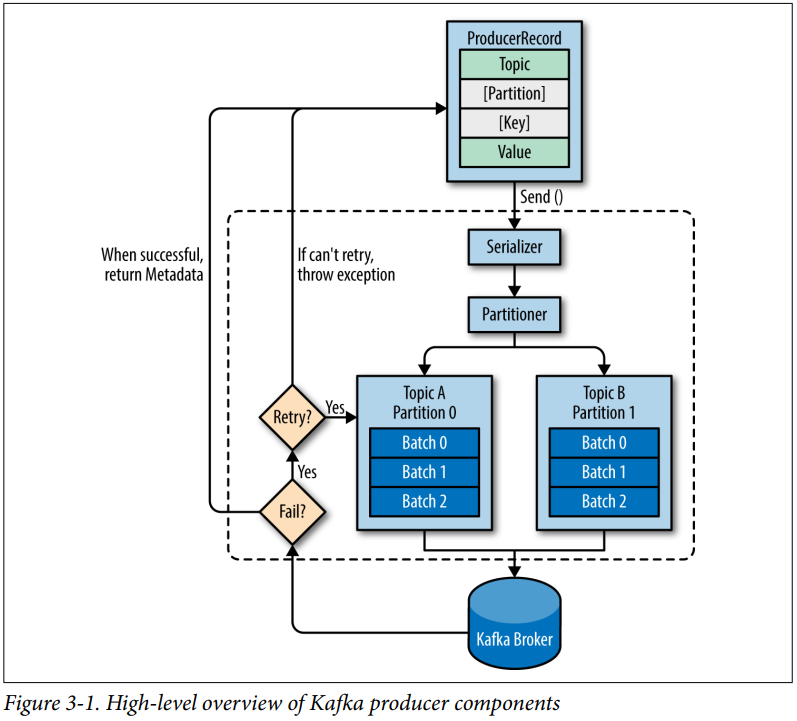

# Chapter 03 "카프카 프로듀서:카프카에 메시지 쓰기"


## 0. 챕터 목표

* 카프카 프로듀서 작성하고 사용하는 방법
* 프로듀서의 개념과 관련 컴포넌트
* KafkaProducer 와 ProducerRecord 객체를 생성하는 방법
* 카프카에 데이터를 전송하는 방법
* 카프카가 반환할 수 있는 에러를 처리하는 방법
* 프로듀서의 실행을 제어하는 데 사용되는 가장 중요한 구성 옵션
* 파티션 처리 방법과 직렬처리기(Serializer)를 사용하고 작성하는 방법


## 1. 프로듀서 개요

* 카프카를 다양한 용도(메트릭 데이터 기록, 로그메시지 저장, 비동기통신, 데이터 버퍼링 등..)로 사용하는 만큼 요구사항도 다양함.
* 메시지 유실 가능 여부, 처리 대기 시간, 처리량 등.. 을 달리 해야하기 때문에 사용하는 방법과 구성을 고려해야 함.

* 

* 프로듀서가 내부적으로 처리하는 작업
    1) 카프카에 쓰려는 메시지를 갖는 ProducerRecord 를 생성.
        - 토픽과 값을 포함해야 한다. 선택적으로 키와 파티션을 지정할 수 있다.
    2) 프로듀서는 키와 값의 쌍으로 이루어진 메시지 객체들이 네트워크로 전송될 수 있도록 바이트 배열로 직렬화 한다. (by. serialize 컴포넌트(클래스))
    3) 해당 데이터가 파티셔너 컴포넌트에 전달되어, ProducerRecord 의 키를 기준으로 파티셔너가 하나의 파티션을 선택해줌
        - 만약 ProducerRecord 에 특정 파티션을 선택했다면, 파티셔너는 특별한 처리를 하지 않고 지정된 파티션을 반환함.
    4) 파티션이 위와 같이 선택되면, 해당 레코드의 메시지가 저장될 토픽과 파티션을 프로듀서가 알게됨
    5) 같은 토픽과 파티션으로 전송될 레코드들을 모은 레코드 배치에 추가하며, 별개의 스레드가 배치를 카프카 브로커에게 전송함.
    6) 브로커는 수신된 레코드의 메시지를 처리한 후 응답을 전송함.
        - 성공시 : RecordMetadata 객체를 반환. (토픽, 파티션, 파티션 내부의 메시지 오프셋을 갖고있는 객체)
        - 실패시 : 에러를 반환. 프로듀서는 에러를 수신 후 메시지 쓰기를 포기하고, 몇번 더 재전송 시도가 가능함.


## 2. 카프카 프로듀서 구성하기

* ProducerRecord 의 메시지를 카프카에 쓰려면, 제일 먼저 프로듀서의 기능을 수행하는 객체를 생성해야 하며, 다음 3개의 필수 속성을 갖음.
    1) bootstrap.servers
        - 카프카 클러스터에 최초로 연결하기 위해 프로듀서가 사용하는 브로커들의 host:port 목록을 이 속성에 설정함.
    2) key.serializer
        - 프로듀서가 생성하는 레코드의 메시지 키를 직렬화하기 위해 사용되는 클래스 이름을 이 속성에 설정함.
          카프카 클라이언트 패키지에 주로 많이 사용하는 ByteArraySerializer, StringSerializer, IntegerSerializer 가 포함되어 있음.
        - 키는 생략하고 값만 전송하고자 할때도 key.serializer를 설정해야 함.
    3) value.serializer
        - 레코드의 메시지 값을 직렬화하는데 사용되는 클래스 이름을 이 속성에 설정함.

    ```
    private Properties kafkaProps = new Properties();
    kafkaProps.put("bootstrap.servers", "broker1:9092,broker2:9092");
    kafkaProps.put("key.serializer", "org.apache.kafka.common.serialization.StringSerializer");
    kafkaProps.put("value.serializer", "org.apache.kafka.common.serialization.StringSerializer");

    producer = new KafkaProducer<String, String>(kafkaProps);
    ```

* 메시지 전송방법 3가지
    1) Fire-and-forget (전송 후 망각)
        - send() 메서드로 메시지를 전송만 하고 성공 또는 실패여부에 따른 후속조치를 취하지 않는 방법.
          실패하더라도 프로듀서가 자동으로 재전송을 시도하므로 대부분의 경우에 메시지 전송이 성공하지만,
          이 방법을 사용하는 경우 일부 메시지가 유실될 수도 있음.

    2) Synchronous send (동기식 전송)
        - send() 메서드로 메시지를 전송하면 자바의 Future 객체가 반환됨.
          그 후 Future 객체의 get() 메서드를 곧바로 호출하면 작업이 완료될 때까지 기다렸다가 브로커로부터 처리 결과가 반환되므로 send() 성공여부를 알 수 있음.

    3) Asynchronous send (비동기식 전송)
        - send() 메서드를 호출할 때 콜백 메서드를 구현한 객체를 매개변수로 전달함.
          콜백 메서드는 카프카 브로커로부터 응답받을때 자동으로 호출되므로 send() 성공여부를 알 수 있음.


## 3. 카프카에 메시지 전송하기

```
ProducerRecord<String, String> record = new ProducerRecord<>("CustomerCountry", "Precision Products", "France");

try {
    producer.send(record);    
} catch (Exception e) {
    e.printStackTrace();
}
```

1) ProducerRecord 객체 생성.
2) send() 메서드를 사용해서 레코드 전송.
    - 메시지는 버퍼(배치)에 수록되었다가 별개의 스레드로 브로커로 전송됨.
    - 브로커가 수신된 레코드의 메시지를 성공적으로 쓰면 RecordMetadata 를 반환.
    - RecordMetadata 를 반환받은 send() 객체는 자바의 Future 객체(RecordMetadata가 포함된)를 반환.
3) 예외처리


### 3-1. 동기식으로 메시지 전송하기

```
ProducerRecord<String, String> record = new ProducerRecord<>("CustomerCountry", "Precision Products", "France");

try {
    producer.send(record).get();
} catch (Exception e) {
    e.printStackTrace();
}
```

1) Future 객체의 get() 메서드를 사용해서 카프카의 응답을 기다림.
    - 실패시 메서드에서 예외처리함.
    - 성공시 RecordMetadata 객체를 받게되어, 카프카에 쓴 메시지의 offset을 알아낼 수 있음.
2) 메시지 전송 전에 에러가 발생하거나, 전송 중 카프카가 재시도 불가능한 에러를 반환했거나, 재시도 횟수를 다 소진했다면 예외 발생.
    - 재시도 가능한 에러 : ex) 커넥션 에러, no leader 둥..
    - 재시도 불가능한 에러 : ex) 메시지 크기가 너무 클 때


### 3-2. 비동기식으로 메시지 전송하기

* 대부분 메시지를 전송만 하고 응답은 알 필요 없으므로 비동기식 메시지 전송이 많음.
  메시지 전송 실패시에는 보통 예외를 발생시키거나, 에러를 로그에 쓰는 등의 작업을 해주면 됨.

```
private class DemoProducerCallback implements Callback {
    @Override
    public void onCompletion(RecordMetadata recordMetadata, Exception e) {
        if (e != null) {
            e.printStackTrace();
        }
    }
}

ProducerRecord<String, String> record = new ProducerRecord<>("CustomerCountry", "Biomedical Materials", "USA");

producer.send(record, new DemoProducerCallback());
```

1) 콜백을 사용하기 위해 callback 인터페이스를 구현하는 클래스가 필요함.
2) 에러 발생시 onCompletion() 메서드의 예외를 받게 됨.
4) send() 메서드를 호출하여 메시지를 전송할 때 콜백 객체를 인자로 전달함.
    - 카프카가 메시지를 쓴 후 응답을 반환할 때, 이 객체의 onCompletion() 메서드가 자동으로 호출되어 실햄됨.


## 4. 프로듀서 구성하기

* 위에서 살펴본 3가지 필수 구성 매개변수(bootstrap.servers, key.serializer, value.serializer)를 제외한 나머지 매개변수(속성)

    1) acks
        - 전송된 레코드를 수신하는 파티션 리플리카(복제서버로 동작하는 브로커)의 수를 제어.
        - acks = 0 일 경우, 프로듀서는 브로커의 응답을 기다리지 않으므로 메시지 유실될 가능성이 있지만 빠른 전송속도(높은 처리량)를 기대할 수 있음.
        - acks = 1 일 경우, 리더 레플리카가 메시지를 받는 순간 프로듀서는 브로커로부터 성공적으로 수신했다는 응답을 받으므로 처리 시간이 오래걸림. 비동기식vs동기식에 따라 속도 달라짐.
        - acks = all 일 경우, 동기화된 모든 리플리카가 메시지를 받아야 프로듀서가 브로커의 성공 응답을 받으므로 메시지 유실로부터 가장 안전하지만 대기시간이 더 길어짐.

    2) buffer.memory
        - 브로커들에게 전송될 메시지의 버퍼로 사ㅛㅇ할 메모리의 양을 설정하는 매개변수.

    3) compression.type
        - 이 매개변수를 활용하면 메시지를 압축하여 전송할 수 있음. 
        - 네트워크 처리량이 제한적일때 사용하면 좋음. 네트워크와 스토리지 사용량을 줄일 수 있음.

    4) retries
        - 프로듀서가 서버로부터 에러를 받았을 때, 메시지를 재전송하는 횟수를 제어할 수 있음.

    5) batch.size
        - 같은 파티션에 쓰는 다수의 레코드에 대해 프로듀서가 레코드들을 배치로 모으는데, 이 때 배치에 사용될 메모리양(바이트)를 제어하는 매개변수.
        - 사이즈를 크게 한다고 해서 배치가 가득 찰 때까지 프로듀서가 기다렸다가 전송하는 것은 아니지만, 메모리를 더 많이 사용하게 됨.
        - 사이즈를 작게 한다면 프로듀서가 메시지를 너무 자주 발송해야 하므로 부담을 초래.

    6) linger.ms
        - 현재 배치를 전송하기 전까지 기다리는 시간.
        - linger.ms를 늘리면 대기시간이 증가하겠지만, 처리량이 늘어남.

    7) client.id
        - 어떤 클라이언트에서 전송된 메시지인지 식별하기 위해 브로커가 사용함.

    8) max.in.flight.requests.per.connetcion
        - 서버의 응답을 받지 않고 프로듀서가 전송하는 메시지의 개수를 제어함.
        - 이 매개변수의 값을 크게 설정하면 메모리 사용은 증가하지만, 처리량이 좋아짐.
        - 너무 큰 값을 설정하면 메시지의 배치 처리가 비효율적이 되므로 오히려 처리량이 안좋아짐.
        - 1로 설정하면 메시지의 전송 순서대로 브로커가 쓰게 됨.

    9) timeout.ms, request.timeout.ms, metadata.fetch.timeout.ms
        - 데이터 전송할 때 / 메타데이터 요청할 때 프로듀서가 서버의 응답을 기다리는 제한 시간. 

    10) max.block.ms
        - send() 메서드를 호출할 때 프로듀서의 전송 버퍼가 가득 차거나, partitionsFor() 메서드로 메타데이터를 요청했지만
          사용할 수 없을때 프로듀서가 기다리는 시간.
        - 이 시간이 경과되면 예외가 발생함.

    11) max.request.size
        - 프로듀서가 전송하는 쓰기 요청(produce request)의 크기를 제어함.
        - 전송될 수 있는 가장 큰 메시지의 크기와 하나의 요청으로 전송할 수 있는 메시지의 최대 개수를 모두 이 매개변수로 제한.

    12) receive.buffer.bytes 와 send.buffer.bytes
        - 데이터를 읽고 쓸 때 소켓이 사용하는 TCP 송수신 버퍼의 크기를 나타냄.
        - -1 일 경우 운영체제의 기본값이 사용됨.
        - 프로듀서와 컨슈머가 서로 다른 데이터센터의 브로커들과 통신할 때엔 이 매개변수 값을 증가시키는것이 좋음.
          데이터센터간 네트워크 연결의 경우 대기시간은 길어지고 네트워크 처리량이 줄어들기 때문.

    * 메시지 순서 보장하기
        - 만약 retries 매개변수를 0이 아닌 값으로 설정하고, max.in.flight.requests.per.connetcion 매개변수를 1보다 큰 값으로 설정하면 전송 실패시 메시지 순서가 바뀔 수 있음.
        - 신뢰성이 중요한 시스템에서는 retries 매개변수를 0으로 설정하고, max.in.flight.requests.per.connetcion 값을 1로 설정함.
          한 메시지의 배치 쓰기가 다시 시도되는 동안에는 다른 메시지들이 추가로 전송되지 않기 때문. (프로듀서의 처리량을 심하게 제한할 수 있으므로 주의)


## 5. 직렬처리기

* 프로듀서의 필수구성에는 직렬처리기가 포함됨. 일반적인 String, Integer, ByteArray 의 경우 카프카에서 지원하지만,
  그 외의 것들은 커스텀 직렬처리기 혹은 아파치 Avro를 알아보아야 함.

### 5-1. 커스텀 직렬 처리기

* 소스 참고하여 커스터마이징 (설명 생략)


### 5-2. 아파치 Avro를 사용해서 직렬화하기

* 아파치 Avro는 언어 중립적인 데이터 직렬화 시스템임.
* Avro는 언어 독립적인 스키마로 데이터 구조를 표현하는 데 주로 JSON 형식으로 기술.
* 데이터를 읽는 모든 애플리케이션을 변경하지 않고 스키마를 변경하더라도 어떤 에러도 발생하지 않으며, 기존 데이터를 변경할 필요도 없다는 장점이 있음.


### 5-3. 카프카에서 Avro 레코드 사용하기

* 소스 참고하여 레코드 사용 (설명 생략)


## 6. 파티션

* 키의 목적은, 메시지를 식별하는 추가 정보를 갖은 것과 메시지를 쓰는 토픽의 여러 파티션 중 하나를 결정하기 위한 것.
* ProducerRecord 객체를 생성할 때, 키를 null로 셋팅할 수 있음.
* 키가 null 이면서 카프카의 기본 파티셔너가 사용될 때는 사용 가능한 토픽의 파티션들 중 하나가 무작위로 선택되어 레코드가 저장됨.
  파티션에 저장되는 메시지 개수의 균형을 맞추기 위해 라운드 로빈 알고리즘이 사용됨.
* 키가 있으면서 기본 파티셔너가 사용될 때는 카프카에서 키의 해시값을 구한 후, 값에 따라 특정 파티션에 메시지를 저장함.
  같은 키는 같은 파티션에 대응되는 것이 중요.

### 6-1. 커스텀 파티셔너 구현하기
```
public class BananaPartitioner implements Partitioner {

    public void configure(Map<String, ?> configs) {}

    public int partition(String topic, Object key, byte[] keyBytes, Object value, byte[] valueBytes, Cluster cluster) {
        List<PartitionInfo> partitions = cluster.partitionsForTopic(topic);
        int numPartitions = partitions.size();

        if ((keyBytes == null) !! (!(key instanceOf String))) {
            throw new InvalidRecordException("We expect all messages to have customer name as key")
        }

        if (((String)key).equals("Banana")) {
            return numPartitions - 1; // 바나나 레코드는 항상 마지막에 쓰기 위함.
        }

        return (Math.abs(Utils.murmur2(keyBytes)) % (numPartitions - 1))
    }

    public void close() {}
}
```
