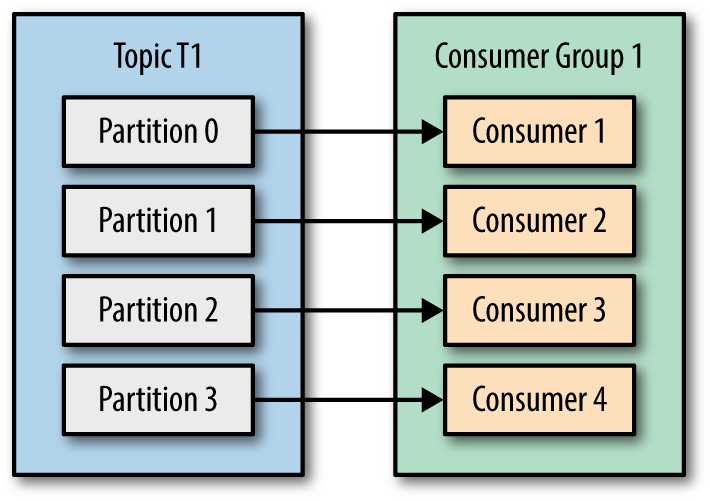

# Chapter 04 "카프카 컨슈머: 카카카에 데이터 읽기"

## 카프카 컨슈머의 중요 개념

### 컨슈머와 컨슈머 그룹
> 다수의 프로듀서들이 같은 토픽의 메시지들을 쓸 수 있는 것과 마찬가지로 다수의 컨슈머들이 같은 토픽의 메시지들을 분담해서 읽을 수 있어야함

* 카프카 컨슈머들은 컨슈머 그룹(consumer group)에 속함.
* 다수의 컨슈머가 같은 토픽을 소비하면서 같은 컨슈머 그룹에 속할 때는 각 컨슈머가 해당 토픽의 서로 다른 파티션을 분담해서 메시지를 읽음
> C1컨슈머는 T1토픽의 네 개 파티션 모두에 있는 메시지들을 읽는다
  

> G1컨슈머 그룹에 또 다른 C2 컨슈머를 추가한다면, 각 컨슈머는 두 개의 파티션에서만 메시지를 읽는다   
  

> G1컨슈머 그룹에 네 개의 컨슈머가 있다면 각 컨슈머는 하나의 파티션에 있는 메시지들만 읽는다
  

> 하나의 컨슈머 그룹에 더 많은 수의 컨슈머를 추가한다면, 일부 컨슈머는 쉬면서 아무 메시지도 읽지 않는다
  
* 하나의 컨슈머 그룹에 더 많은 컨슈머를 추가하면 카프카 토픽의 데이터 소비를 확장할 수 있음
    * 대기 시간이 긴 작업을 수행하는 카프카 컨슈머에 많이 사용됨 (하나의 컨슈머로는 토픽의 데이터 추가 속도를 따라 잡을 수 없음)
* 각 컨슈머가 여러 파티션을 분담하여 작업량을 공유하도록 더 많은 컨슈머를 추가하는 것이 소비 확장의 중요한 방법
    * 반대로 많은 수의 파티션을 갖도록 토픽을 생성하는 이유이기도 함(작업량이 증가할 때 더많은 컨슈머를 추가할 수 있음)

> 각 애플리케이션에서 하나 이상의 토픽에 장된 모든 메시들을 읽어야 할 때는 애플리케이션마다 컨슈머 그룹을 생성

 * 같은 토픽의 데이터를 다수의 애플리케이션이 읽어야 하는 경우
    * 각 애플리케이션이 토픽의 일부 메시지가 아닌 모든 메시지를 읽어야 한다.
    * 각 애플리케이션이 자신의 컨슈머 그룹을 가지도록 해야 한다

### 컨슈머 그룹과 리밸런싱

1) 파티션의 소유권(ownership) 
    - 파티션 자신들이 읽는 토픽의 파티션 대응 하는 무언가..
    - 특정 컨슈머가 중달 될때, 남은 컨슈머 중 하나가 재할당 받음
    - 해당 컨슈머 그룹이 읽는 토픽들에 변경 사항이 생길때, 파티션의 재할당이 생김

2) 리밸런싱(rebalancing)
    - 한 컨슈머로부터 다른 컨슈머로 파티션 소유권(ownership)을 이전하는 것
    - 컨슈머 그룹의 가용성과 확장성을 높여줌
    - **리밸런싱을 하는동안 컨슈머 메시지를 읽을수 없어 컨슈머 그룹전체가 사용불가 및 컨슈머로부터 다른 컨슈머로 파티션이 이전될때 이전 파티션 현재 상태정보 사라짐**
        - 캐시 메모리에 있던 데이터도 지워지므로 컨슈머의 해당 파티션 상태 정보가 다시 설정될 때 까지 애플리케이션이 느려질 수 있음.

3) 리밸런싱(rebalancing) 올바르게 사용 방법
    - 그룹 조정자 (group coordinator)
        - GroupCoordinator 클래스의 인스턴스로 생성되어 백그라운드 프로세스로 실행되는 카프카 브로커
    - 하트비트(heartbeat) 
        - 컨슈머의 상태를 알리기위해 전송되는 신호
        - 컨슈머가 폴링을 할 떄 또는 익은 메시지를 커밋할 때 자동으로 그룹조정자에게 전달
    > 컨슈머가 그룹조정자에게 하트비트를 일정시간 간격으로 전송하여, 컨슈머가 살아있고 잘동작하는 파악(자신의 메시지를 처리 가능한 것으로 간주)하고,  
      하트비트 전송을 중단하면, 컨슈머가 죽은것으로 간주하고 리밸런싱 처리
    
### 카프카 컨슈머 생성하기

1) bootstrap.servers 
    - 카프카 클러스터에 연결하기 위한 문자열이며, kafkaProducer와 같은 방법으로 사용
2) key.deserializer , value.deserializer
    - 프로듀서에 정의되는 직렬처리기와 반대 기능을 수행하는 역직렬처리기를 지정
3) group.id
    - 컨슈머 그룹을 나타냄

### 토픽 구독하기
* 컨슈머를 생성한 다음에는 하나 이상의 토픽을 구독(subscribe)를 해야한다.

### 폴링 루프
* 컨슈머 api의 핵심은 서버로부터 연속적으로 많은 데이터를 읽기 위해 폴링하는 루프에 있음
* poll() 메서드의 매개변수는 데이터 도착하기를 기다리는 시간이다.
* 컨슈머 종료시 close()를 실행해야 한다. 그럼 곧바로 리밸런싱이 일어남
* 새로운 컨슈머에서 최초 poll() 호출시 그룹조정자를 찾고, 컨슈머 그룹에 추가시키며, 파티션 내역을 받는 작업이 일어남
    
### 컨슈머 구성하기
* fetch.min.bytes : 브로커로부터 받기 원하는 데이터의 최소량 (default: 1bytes)
* fetch.max.wait.ms : 데이터가 모일 때까지 기다리는 시간 (default : 500ms)
* max.partition.fetch.bytes : 파티션당 반환하는 최대 바이트수 (default : 1MB)
* session.timeout.ms : 컨슈머가 브로커와 연결이 끊기는 시간, 하트비트 전송이 그룹조정자에게 해당 매개변수 일어나지 않으면 컨슈머가 종료된 것으로 간주 (default : 10000ms)
* heartbeat.interval.ms : 하트비트를 전송하는 시간 간격 (default : 3000ms)
* auto.offset.reset : 커밋되지 않은 오프셋이나 유효하지 않는 오프셋을 컨슈머가 요청할 때 어떤 레코드를 읽게 할지에 대한 설정 값, 유효한 오프셋이 없다고 판단하여 최근 레코드들을 선택하는 'latest', 맨 앞부터 다시 읽는 'earliest'가 있다. (default : latest)
* enable.auto.commit : 컨슈머가 오프셋 커밋을 자듕으로 할 것인지 (default : true)
* partition.assignment.strategy : 파티션과 컨슈머의 할당 전략, Range와 RoundRobin이 기본적으로 존재하고 사용자가 구현 가능 (default : Range)
* client.id : 클라이언트로 부터 전송된 메시지 식별용 값
* max.poll.records : 한 번의 poll() 메서드 호출에서 반환되는 레코드의 최대 개수 (default : 500)
* receive.buffer.bytes, send.buffer.bytes : tcp 송수신 버퍼 크기
* max.poll.interval.ms : rebalance Timeout 이내에 JoinGroup 요청을 보내야 하는데 그 시간을 설정 , HeartBeat 스레드가 현재 시간과 마지막으로 poll 메서드가 호출된 시간의 차이를 계산하여 설정값 보다 큰 경우 컨슈머 그룹 탈퇴(default : 300000)

### 커밋과 오프셋
* 카프카의 각 컨슈머는 파트션별로 자신이 읽는 레코드의 현재 위치(오프셋)을 추적 관리
* 파티션 내부의 현재 위치를 변경하는 것을 커밋 이라고 함
* 기존 컨슈머가 비정상적으로 종료되거나 새로운 컨슈머가 그룹에 추가 된다면 리밸런싱을 유발
* 어느 위치부터 메시지를 읽어야 할지 알기 위해서, 컨슈머는 각 파티션의 마지막으로 커밋된 오프셋을 알아낸 후 거기서부터 읽어야함
* 리밸런싱 후 마지막으로 커밋된 오프셋과 현재 읽고 처리중인 메시지가 다를경우 메시지가 두번 처리 되거나, 누락될 수 있음

### 자동 커밋
* 일정 시간마다 마지막으로 호출된 poll()메서드에서 반환된 오프셋을 커밋
* 다만 리밸런싱 후 모든 컨슈머는 마지막으로 커밋된 오프셋부터 레코드를 읽기 시작하므로 마지막 커밋 이후 읽었던 레코드는 두번 처리 된다.(그림 4-6)
* 자동 커밋 시간을 줄여서 중복을 줄일수 있지만, 완전히 없애는 것은 불가능
* poll() 메서드에서 반환된 모든 메시지는 다시 poll()을 호출하기 전에 끝나도록 하는게 중요
* 편리하지만 중복 메시지 방지를 제어하기에는 충분하지 않음

### 현재의 오프셋 커밋하기
1) commitSync()
    - poll() 에서 반환된 가장 최근의 오프셋을 커밋
    - poll() 에서 반환된 모든 레고의 처리가 다 된후 호출해야함 > 메시지 누락 위험 방지
    - 성공하거나 재시도 불가능한 에러 생길떄 까지 재시도
2) 비동기 커밋
    - 재시도 하지 않음 > 순서 보장되지 않음
    - 콜백 사용가능
3) 동기와 비동기 커밋을 같이 사용하기;
    - 여기서는 처리할때는 비동기 커밋, 컨슈머 종료할때는 동기 커밋사용
4) 특정 오프셋을 커밋하기
    - commitSync, commitAsyncs는 기본적으로 마지막으로 반환된 오프셋을 커밋
    - 커밋을 원하는 파티션과 오프셋을 저장한 Map 인자 전달 가능

### 특정 오프셋을 커밋하기
* commitSync, commitAsyncs는 기본적으로 마지막으로 반환된 오프셋을 커밋
* 커밋을 원하는 파티션과 오프셋을 저장한 Map 인자 전달 가능

## 리밸런싱 리스너
> 컨슈머는 종료되기 전이나 파티션 리밸러싱이 시작되기 전에 클린업하는 처리를 해야한다.

1) onPartitionsRevoked()
    - 리밸런싱이 시작되기 전에, 컨슈머가 메시지소비를 중단한 후 호출
    - 오프셋을 커밋을 함
    - 현재의 파티션을 이어서 다른 컨슈머가 어디서 파티션의 메시지를 소비를 시작할지 알수 있음

2) onPartitionsAssigned()
    - 컨슈머가 파트션을 새로 할당 받아 메시지 소비를 시작하기 전에 호출

 ## 특정 오프셋을 사용해서 레코드 소비하기
 1) seeekToBeginning(), seekToEnd()   
    - 특정 오프셋을 찾아 메시지를 소비하는 기능
    - 레코드와 오프셋을 하나의 데이터베이스에 저장후 seek()을 통해서 오프셋 위치 파악후 처리(트랜잭션으로 묶기)

 ## 어떻게 폴링 루프를 벗어나야 할까?
 > 폴링 루프를 벗어나서 컨슈머를 종료시키기
 * 다른 스레드에서 kafkaconsumer.wakeup() 호출
    - 다른스레드에서 안전하게 호출할 수 있는 컨슈머 메서드
    - wakeupException예외 발생으로 인해서 poll()메서드 중단
    - 컨슈머 스레드를 종요하기 전에 반드시 close() 메서드를 호출하여 닫아야 함

## 역직렬처리기
> 카프카 컨슈머는 카프카로부터 받은 바이트 배열을 자바 객체로 변환하는 역직렬처리기(deserializer)가 필요
* 카프카에서 쓰는 메시지를 생성하기 위해 사용되는 직렬처리기와, 메시지를 읽을 떄 사용되는 역직렬처리기와 호환이 되야함
    - **개발는 각 토픽 메시지를 쓸때 어떤 직렬처리기를 사용했는지 알아야하고ㅓ, 역직렬처리기가 처리할 수 있는 데이터만 포함하는지도 확인해야함**

### 커스텀 역직렬처리기
> 커스텀 직렬처리기와 역직렬처리기를 직접 구현하는 것은 바람직하지 않으며, JSON, Thrift, Protobuf, Avro와 같은 표준 메시지를 사용 권장

### 카프카 컨슈머에서 Avro 역직렬처리기 사용하기

## 독자 실행 컨슈머 : 그룹 업이 하나의 컨슈머만 사용하는 이유와 방법

