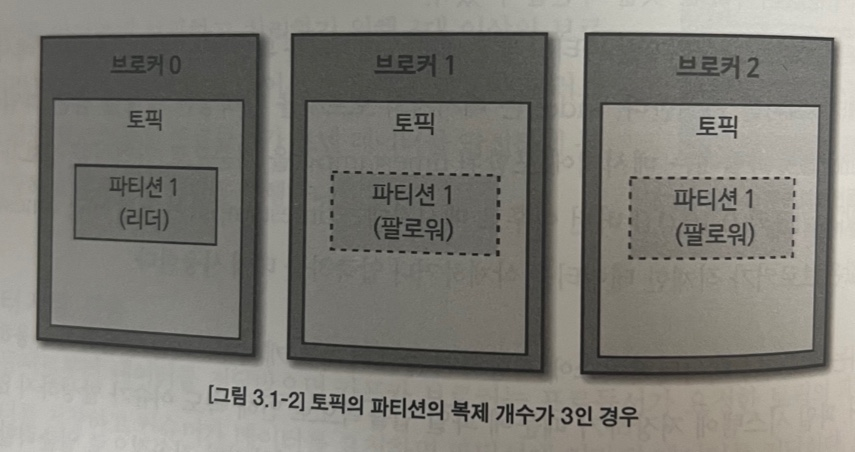
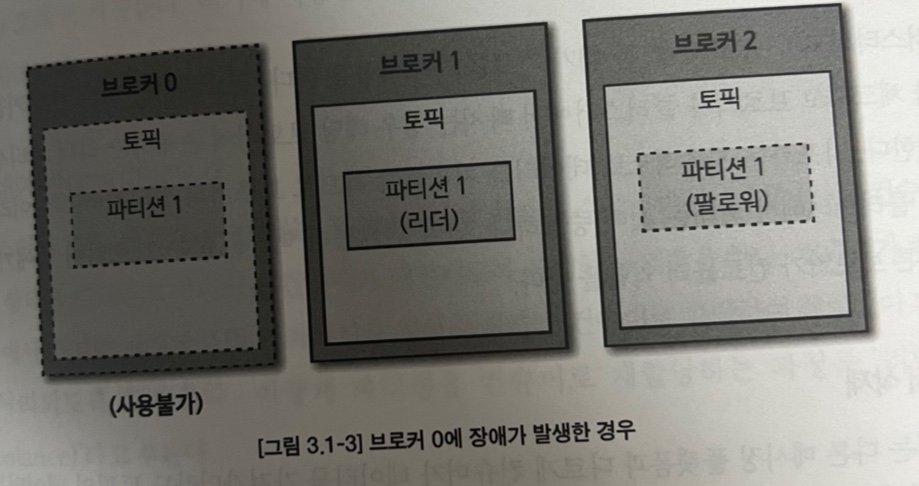

# Chapter 05 "카프카 내부 메커니즘"

## 0. 챕터 목표

- 카프카 복제(replication)가 동작하는 방법
- 카프카가 프로듀서와 컨슈머의 요청을 처리하는 방법
- 카프카가 스토리지(예를들어 파일 형식이나 인덱스)를 처리하는 방법

## 1. 클러스터 멤버십

- 클러스터 멤버십은 카프카 브로커, 주키퍼, 컨슈머, 프로듀서를 의미
- 데이터 저장하는 노드를 znode라고 함
- /kafka-main(카프카 클러스터가 사용하는 주키퍼의 최상위 노드)/kafka-sub1, /kafka-main/kafka-sub2
  ⇒ 위 경로처럼 각 노드의 위치 식별.
- /kafka-main/controller
- /kafka-main/brokers
- /kafka-main/config - 토픽 설정정보
- 이 znode들은 주키퍼에게 모니터링(Watch)를 요청
- Watch의 콜백으로 해당 노드가 살아있는지 판단
- 브로커가 중단되면 해당 브로커의 주키퍼 노드는 삭제 됨

## 2. 컨트롤러

- 클러스터의 다수 브로커 중 한 대가 컨트롤러의 역할을 함
- 다른 브로커들의 상태를 체크하고 브로커가 클러스터에서 빠지는 경우 해당 브로커에 존재하는 리더 파티션을 재분배
- 카프카는 지속적으로 데이터를 처리해야하므로 브로커의 상태가 비정상이라면 빠르게 클러스터에서 빼내는 것이 중요
- 컨트롤러 역할을 하는 브로커에 장애가 생기면 다른 브로커가 컨트롤러 역할을 함

> - 브로커란 ?  
    카프카 **클라이언트와 데이터를 주고받기 위해 사용하는 주체**이자 데이터를 분산 저장하여 장애가 발생하더라도 안전하게 사용할 수 있도록 도와주는 애플리케이션. 
    브로커 1대로도 기본 기능이 실행되지만, 데이터를 안전하게 보관하고 처리하기 위해 보통 3대 이상의 브로커를 1개의 클러스터로 묶어서 운영
>

## 3. 복제

- 카프카 아키텍처의 핵심
- 각 서버 노드에 장애가 생길 때 카프카가 가용성과 내구성을 보장하는 방법
- 클러스터로 묶인 브로커 중 일부에 장애가 발생하더라도 데이터를 유실하지 않고 안전하게 사용하기 위함

1) 리더 리플리카(Leader replica)

- 프로듀서 또는 컨슈머와 직접 통신하는 파티션
- 일관성을 보장하기 위해 모든 프로듀서와 컨슈머 클라이언트의 요청은 리더를 통해 처리됨

2) 팔로어 리플리카(Follower replica)

- 리더를 제외한 나머지 복제 데이터를 가지고 있는 파티션
- 클라이언트 요청을 서비스하지는 않음
- 대신 리더의 메시지를 복제하여 리더의 것과 동일하게 유지
    - 리더 파티션의 오프셋을 확인하여 현재 자신이 가지고있는 오프셋과 차이가 나는 경우 리더로부터 데이터를 가져와 자신의 파티션의 저장. 이 과정을 복제(replication) 이라고 함
- 특정 파티션의 리더 리플리카가 중단되는 경우 팔로어 리플리카 중 하나가 해당 파티션의 새로운 리더로 선출
- 복제 개수만큼의 저장 용량이 증가한다는 단점이 있음
- 그러나 복제를 통해 **데이터를 안전하게 사용할 수 있다는 강력한 장점** 때문에 카프카를 운영할 때 2 이상의 복제 개수를 정하는 것이 중요
  
- 토픽 파티션의 복제 개수가 3인 경우

- 브로커 0에 장애가 발생한 경우 
=> 리더 변경
  

## 4. 요청 처리

- 카프카 브로커가 하는 일은 대부분 클라이언트와 파티션 리플리카 및 컨틀로러부터 파티션 리더에게 전송되는 요청을 처리하는 것
- 클라이언트로부터 브로커에 전송된 모든 요청은 항상 수신된 순서로 처리
  ⇒ 메시지 큐 처럼 동작할 수 있기 때문에 저장되는 메시지 순서가 보장됨
- 요청은 모두 파티션의 리더 리플리카에게 전송되어야 함.함  
  ⇒ 리더가 아닌 리플리카에게 전송하였을 때 에러를 응답받음
- 어디로 요청해야할 지 클라이언트가 어떻게 알 수 있을까? 
  ⇒ 메타데이터 요청(metadata request)라는 또 다른 요청 타입 사용.
- 클라이언트는 메타데이터 정보(토픽에 존재하는 파티션들, 각 파티션의 리플리카, 어떤 리플리카가 리더인지 등)를 캐시에 보존하여 각 파티션의 올바른 브로커에 요청하는데 쓴다.
- 모든 요청은 다음의 내용을 포함하는 헤더를 갖는다.
    - 요청 타입 ID : 어떤 요청인지를 나타내는 16비트 정수 형식의 고유 번호
    - 요청 버전 : 이 요청의 프로토콜 API 버전
    - cID(correlation ID) : 사용자가 지정한 32비트 정수값
    - 클라이언트 ID : 사용자가 지정한 문자열 형식의 값이며, null 이 될 수 있음

1) 쓰기 요청

- 프로듀서가 전송하며 카프카 브로커에게 쓰려는 메세지를 포함
- 브로커가 해당 파티션에 쓰기 요청을 받았을 때 검사하는 것
    - 데이터를 전송한 사용자가 해당 토픽의 쓰기 권한을 갖고 있는가?
    - 해당 요청에 지정된 acks(0, 1, ‘all’ 중 하나만 가능)이 적합한가?
    - 만일 acks가 all로 설정되었다면 메시지를 안전하게 쓰는데 충분환 동기화 리플리카들이 있는가?

> acks 값 구분 
0 : 브로커의 수신 응답을 기다리지 않음 
1 : 리더만 메세지를 받으면 됨 
all : 모든 리플리카가 메시지를 받아야 함
>

2) 읽기 요청

- 카프카 브로커로부터 메세지를 읽을 때 컨슈머와 팔로어 리플리카가 전송
- 클라이언트는 읽기를 원하는 토픽과 파티션 및 오프셋에 있는 메세지들의 읽기 요청을 브로커에 전송
  ex) Test 토픽의 0 파티션의 53 오프셋부터 시작하는 메세지들을 전송해주세요.
- 클라이언트는 각 파티션마다 브로커가 반환할 수 있는 데이터의 상한/하한 크기 제한 가능

## 5. 스토리지

- 카프카의 기본적인 스토리지 단위는 **파티션 리플리카**
- 하나의 파티션은 여러 브로커 간에 분할 될 수 없음
  ⇒ 따라서 하나의 파티션 크기는 단일 마운트 포인트에 사용 가능한 공간으로 제한됨
- 카프카를 구성할 때 관리자는 파티션이 저장될 디렉터리 내역을 log.dirs 매개 변수에 지정

1) 파일관리

- 카프카는 데이터를 영원히 보존(retention) 하지 않음
- 메세지 삭제 전 모든 컨슈머가 읽기를 기다리지도 않음
- 두 가지 중 하나로 각 토픽별 보존 구성을 설정할 수 있음
    - 삭제 보존 정책(delete) : 보존 기간 이전이 메세지들을 삭제
    - 압축 보존 정책(compact) : 각 키의 가장 최근 값만 토픽에 저장

2) 인덱스

- 컨슈머가 특정 오프셋 부터 읽을
- 카프카는 각 파티션의 인덱스를 유지 및  관리
- 인덱스도 세그먼트 파일로 관리
- 메세지가 삭제되면 연관된 인덱스 항목도 삭제됨

### 참고

- [https://www.popit.kr/kafka-%EC%9A%B4%EC%98%81%EC%9E%90%EA%B0%80-%EB%A7%90%ED%95%98%EB%8A%94-topic-replication/](https://www.popit.kr/kafka-%EC%9A%B4%EC%98%81%EC%9E%90%EA%B0%80-%EB%A7%90%ED%95%98%EB%8A%94-topic-replication/)
