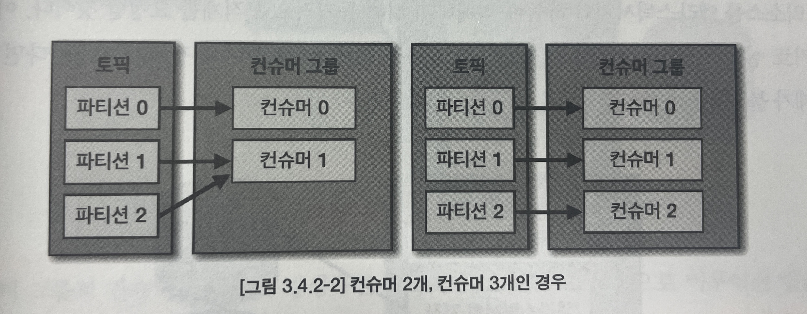
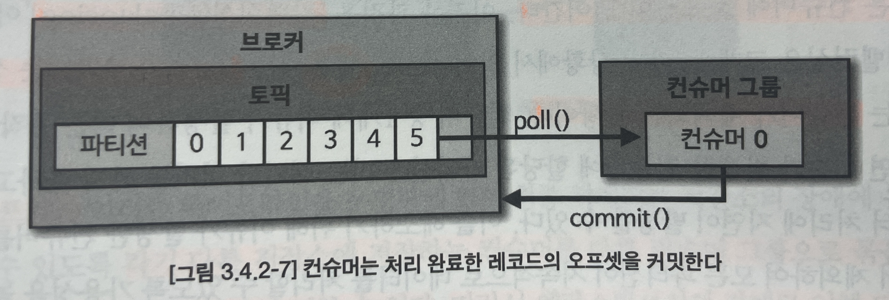
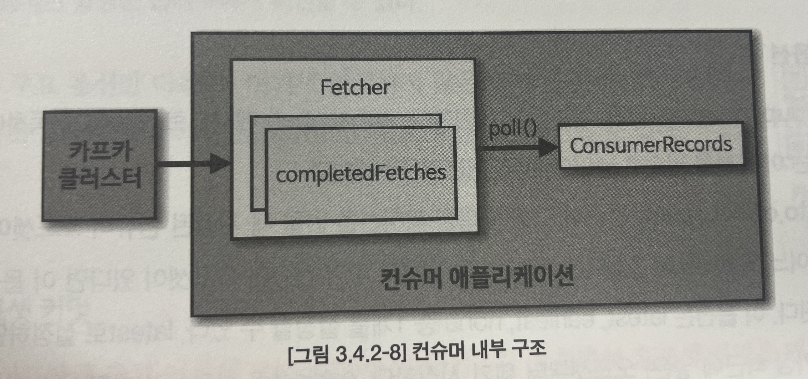

# Chapter 03 "카프카 기본 개념 설명"

### 4.2. 컨슈머 API

* 프로듀서가 전송한 데이터는 카프카 브로커에 적재된다.
* 컨슈머는 적재된 데이터를 사용하기 위해 브로커부터 데이터를 가져와서 필요한 처리를 한다.

#### 1) 카프카 컨슈머 프로젝트 생성

```java
public class SimpleConsumerTests {
    private final static Logger logger = LoggerFactory.getLogger(SimpleConsumerTests.class);
    private final static String TOPIC_NAME = "test";
    private final static String BOOTSTRAP_SERVERS = "my-kafka:9092";
    private final static String GROUP_ID = "test-group";    // 컨슈머 그룹 지정 (컨슈머 목적 구분)

    public static void main(String[] args) {
        Properties configs = new Properties();
        configs.put(ConsumerConfig.BOOTSTRAP_SERVERS_CONFIG, BOOTSTRAP_SERVERS);
        configs.put(ConsumerConfig.GROUP_ID_CONFIG, GROUP_ID);
        configs.put(ConsumerConfig.KEY_DESERIALIZER_CLASS_CONFIG, StringDeserializer.class.getName());
        configs.put(ConsumerConfig.VALUE_DESERIALIZER_CLASS_CONFIG, StringDeserializer.class.getName());

        // KafkaConsumer 인스턴스를 생성하여 데이터를 가져온다.
        KafkaConsumer<String, String> consumer = new KafkaConsumer<>(configs);

        // 컨슈머에게 토픽을 할당한다.
        consumer.subscribe(Arrays.asList(TOPIC_NAME));

        while (true) {  // 지속적으로 반복 호출 하기 위함.
            // 컨슈머는 poll() 메서드를 호출하여 데이터를 가져와 처리한다.
            ConsumerRecords<String, String> records = consumer.poll(Duration.ofSeconds(1));
            for (ConsumerRecord<String, String> record : records) {
                logger.info("record:{}", record);
            }
        }
    }
}
```

* 컨슈머 그룹
  * 컨슈머의 목적을 구분하여 동일한 역할을 하는 컨슈머를 묶어서 관리한다.
  * 컨슈머 그룹을 기준으로 컨슈머 오프셋을 관리한다.
    * subscribe() 메서드를 사용하여 토픽을 구동하는 경우에는 컨슈머 그룹을 선언해야 한다.
    * 컨슈머가 중단되거나 재시작되더라도 컨슈머 그룹의 컨슈머 오프셋을 기준으로 이후 데이터를 처리한다.
* test 토픽에 데이터 넣어주기

```bash
$ bin/kafka-console-producer.sh --bootstrap-server my-kafka:9092 --topic test
>testMessage
```

* 결과 확인
```
[main] INFO org.apache.kafka.clients.consumer.KafkaConsumer - [Consumer clientId=consumer-test-group-1, groupId=test-group] Subscribed to topic(s): test
...
[main] INFO com.example.consumer.simpleKafkaConsumer.SimpleConsumerTests - record:ConsumerRecord(topic = test, partition = 0, leaderEpoch = 0, offset = 0, CreateTime = 1654756727453, serialized key size = -1, serialized value size = 11, headers = RecordHeaders(headers = [], isReadOnly = false), key = null, value = testMessage)
```

#### 2) 컨슈머 중요 개념 (컨슈머 그룹 운영)

* 컨슈머 운영 방법
  1. 토픽의 특정 파티션만 구독하는 컨슈머를 운영
  2. 1개 이상의 컨슈머로 이루어진 컨슈머 그룹을 운영 (아래에서 이 방법에 대한 내용을 설명한다.)
* 컨슈머 그룹<br>
  
  * 컨슈머의 목적을 구분하여 동일한 역할을 하는 컨슈머를 묶어서 관리한다.
  * 컨슈머를 각 컨슈머 그룹으로부터 격리된 환경에서 안전하게 운영한다.
  * 1개의 파티션은 최대 1개의 컨슈머에 할당 가능하므로<br>
    (컨슈머 그룹의 컨슈머 개수) <= (가져가고자 하는 토픽의 파티션 개수)
  * 컨슈머 그룹은 다른 컨슈머 그룹과 격리되므로, 카프카 프로듀서가 보낸 데이터를 각기 다른 역할을 하는 컨슈머 그룹끼리 영향을 받지 않게 처리할 수 있다.<br>
    따라서, 장애 대응을 위하여 컨슈머 그룹으로 따로 나눌 수 있는 것은 최대한 나누는 것이 좋다.
* 리밸런싱(rebalancing): 컨슈머 일부에 장애가 발생하면, 장애가 발생한 컨슈머에 할당된 파티션은 장애가 발생하지 않은 컨슈머에 소유권이 넘어간다.
  * 컨슈머가 추가/제외되는 상황에서 발생한다.
  * 데이터 처리 중 언제든지 발생할 수 있으므로, 리밸런싱에 대응하는 코드를 작성해야 한다.
  * 그룹 조정자(group coordinator): 컨슈머 그룹의 컨슈머가 추가되고 삭제될 때를 감지하여 리밸런싱을 발동시키는 역할을 한다.
* 커밋(commit): 컨슈머는 카프카 브로커로부터 데이터를 어디까지 가져갔는지 commit을 통해 기록한다.<br>
  
  * 내부 토픽(__consumer_offsets)에 기록된다.
  * 오프셋 커밋이 기록되지 못하면 데이터 처리의 중복이 발생할 수 있으므로, 컨슈머 애플리케이션이 오프셋 커밋을 정상적으로 처리했는지 검증해야만 한다.
  * 오프셋 커밋 수행
    * 비명시 오프셋 커밋
      * 일정 간격마다 자동으로 커밋
      * auto.commit.interval.ms
      * 데이터 중복/유실 가능성이 있다.
    * 명시적 오프셋 커밋
      * commitSync()/commitAsync()
      * poll() 메서드를 통해 반환된 레코드의 가장 마지막 오프셋을 기준으로 커밋을 수행한다.
* 컨슈머의 내부 구조
  
  * poll() 메서드를 호출하는 시점에 클러스터에서 데이터를 가져오는 것이 아니다.
  * 내부에서 Fetcher 인스턴스가 생성되어 poll() 메서드를 호출하기 전에 미리 레코드들을 내부 큐로 가져온다.
  * 이후에 사용자가 명시적으로 poll() 메서드를 호출하면, 컨슈머는 내부 큐에 있는 레코드들을 반환받아 처리를 수행한다.

#### 3) 컨슈머 주요 옵션

* 필수 옵션
  * bootstrap.servers
  * key.deserializer
  * value.deserializer
* 선택 옵션
  * group.id - subscribe() 메서드로 토픽 구독시 필수
  * auto.offset.reset - 저장된 오프셋이 없을 때 어느 오프셋부터 읽을 지 선택 (latest/earliest/none)
  * enable.auto.commit
  * auto.commit.interval.ms
  * max.poll.records
  * session.timeout.ms
  * heartbeat.interval.ms
  * max.poll.interval.ms
  * isolation.level

#### 4) 동기 오프셋 커밋

* poll() 메서드 호출 이후, commitSync() 메서드를 호출하여 명시적으로 오프셋 커밋 수행
* commitSync()는 poll() 메서드로 받은 가장 마지막 레코드의 오프셋을 기준으로 커밋하기 때문에, poll() 메서드로 받은 모든 레코드의 처리가 끝난 이후 commitSync()를 호출해야 한다.

```java
// 명시적 오프셋 커밋 수행시 false
configs.put(ConsumerConfig.ENABLE_AUTO_COMMIT_CONFIG, false); 
...
while (true) {
    ConsumerRecords<String, String> records = consumer.poll(DuratioofSeconds(1));
    for (ConsumerRecord<String, String> record : records) {
        logger.info("record:{}", record);
    }
    // poll() 메서드로 받은 가장 마지막 레코드의 오프셋을 기준으로 커밋한다.
    consumer.commitSync();
}
```

* 개별 레코드 단위로 매번 오프셋을 커밋하고 싶다면, commitSync() 에 Map<TopicPartition, OffsetAndMetadata> 를 파라미터로 넣는다.
  * 이 때, 처리한 오프셋에 1을 더한 값을 커밋해야 한다. 이후에 컨슈머가 poll()을 수행할 때 마지막으로 커밋한 오프셋부터 레코드를 리턴하기 때문이다.

```java
while (true) {
    ConsumerRecords<String, String> records = consumer.poll(Duration.ofSeconds(1));
    // 현재 처리한 오프셋을 매번 커밋하기 위한 파라미터
    Map<TopicPartition, OffsetAndMetadata> currentOffset = new HashMap<>();
    for (ConsumerRecord<String, String> record : records) {
        logger.info("record:{}", record);
        currentOffset.put(
                new TopicPartition(record.topic(), record.partition()), // key
                new OffsetAndMetadata(record.offset() + 1, null));  // value (현재 처리한 오프셋에 1을 더한 값)
        consumer.commitSync(currentOffset); // 해당 토픽, 파티션의 오프셋이 매번 커밋된다.
    }
}
```

#### 5) 비동기 오프셋 커밋

* commitAsync() 메서드 호출
* 비동기로 커밋 응답을 받기 때문에 callback 함수를 파라미터로 받아서 결과를 얻을 수 있다.
  * OffsetCommitCallback: commitAsync()의 응답을 받을 수 있도록 도와주는 콜백 인터페이스이다.
  * 비동기로 받은 커밋 응답은 onComplete() 메서드를 통해 확인한다.
  * 정상적으로 커밋시, 커밋 완료된 오프셋 정보는 Map<TopicPartition, OffsetAndMetadata> 에 포함되어 있다.

```java
while (true) {
    ConsumerRecords<String, String> records = consumer.poll(Duration.ofSeconds(1));
    for (ConsumerRecord<String, String> record : records) {
        logger.info("record:{}", record);
    }
    consumer.commitAsync(new OffsetCommitCallback() {   // Callback Interface
        public void onComplete(Map<TopicPartition, OffsetAndMetadata> offsets, Exception e) {   // 비동기로 받은 커밋 응답 확인
            if (e != null) {
                System.err.println("Commit failed");
            } else {    // 정상적으로 커밋 되었다면 Exception e 변수는 null이다.
                System.out.println("Commit succeeded for offsets " + offsets);
            }
            if (e != null) {
                logger.error("Commit failed for offsets {}", offsets, e);
            }
        }
    });
}
```

```
Commit succeeded for offsets {test-0=OffsetAndMetadata{offset=2, leaderEpoch=0, metadata=''}}
```

#### 6) 리밸런스 리스너를 가진 컨슈머

* 컨슈머 그룹에서 컨슈머가 추가/제거되면 파티션을 컨슈머에 재할당하는 과정인 리밸런스가 일어난다.
* 이 때, poll() 메서드를 통해 반환받은 데이터를 모두 처리하기 전에 리밸런스가 발생하면, 커밋이 완료되지 않았기 때문에 데이터를 중복 처리할 수 있다.
* 따라서, 리밸런스 발생 시 처리한 데이터를 기준으로 커밋을 시도해야 한다.
* ConsumerRebalanceListener 인터페이스
  * onPartitionAssigned()
    * 리밸런스가 끝난 뒤 파티션이 할당 완료되면 호출되는 메서드
  * onPartitionRevoked() 메서드
    * 리밸런스가 시작되기 직전에 호출되는 메서드
    * 마지막으로 처리한 레코드를 기준으로 커밋을 하기 위해서는 리밸런스 시작 직전에 커밋을 하면 되므로, 이 메서드에 커밋을 구현한다.

```java
public static void main(String[] args) {
    ...
    consumer.subscribe(Arrays.asList(TOPIC_NAME), new RebalanceListener());
    ...
}
private static class RebalanceListener implements ConsumerRebalanceListener {
    @Override
    public void onPartitionsRevoked(Collection<TopicPartition> partitions) {
        logger.warn("Partitions are assigned : " + partitions.toString());
    }
    @Override
    public void onPartitionsAssigned(Collection<TopicPartition> partitions) {
        logger.warn("Partitions are revoked : " + partitions.toString());
        // 리밸런스가 발생하면 가장 마지막으로 처리 완료한 레코드를 기준으로 커밋한다.
        consumer.commitSync();  
    }
}
```

#### 7) 파티션 할당 컨슈머

* subscribe가 아닌 assign() 메서드를 이용하여 직접 파티션을 컨슈머에 명시적으로 할당하여 운영한다.
* 직접 컨슈머가 특정 토픽, 특정 파티션에 할당되므로 리밸런싱 하는 과정이 없다.

```java
consumer.assign(Collections.singleton(new TopicPartition(TOPIC_NAME, PARTITION_NUMBER)));
```

#### 8) 컨슈머에 할당된 파티션 확인 방법

```java
Set<TopicPartition> assignedTopicPartition = consumer.assignment();
```

#### 9) 컨슈머의 안전한 종료

* 정상적으로 종죠되지 않은 컨슈머는 세션 타임아웃이 발생할때까지 컨슈머 그룹에 남게 되므로, 파티션의 데이터는 소모되지 못하고 컨슈머 랙이 늘어나게 된다.
* wakeup() 메서드 사용 - wakeup() 가 실행된 이후 poll() 이 호출되면 WakeupException 예외가 발생한다.

